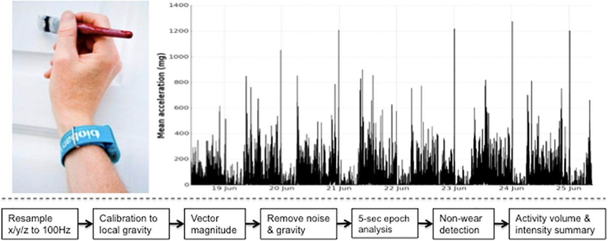

```{r setup, include=FALSE}
knitr::opts_chunk$set(echo = FALSE, 
                      warning = FALSE, 
                      message = FALSE)
library(readr)
library(knitr)
library(kableExtra)
options("kableExtra.html.bsTable" = TRUE)
```

## Disclaimer (Acknowledgements?)

<br><br>
<div style="font-size:40pt" id="left_col">


Work done with <br>
[Andrew Leroux](https://www.jhsph.edu/departments/biostatistics/directory/students/phd.html)
<br>PhD Student at Johns Hopkins 
</div>
```{r, out.width="20%", fig.align="right"}

```

## UK Biobank Data

<div style="font-size:30pt">

- Overall 500,000 participants (UK), ≈ 100,000 included in the sub-study

In this presentation: 

- Explore the data 
- Assess "bias" in different devices (see if "autocalibration" is working)
- Also discuss inclusion criteria "bias"
- Get similar findings [@doherty2017large] analysis

</div>

## Where do 100K come from?

```{r, out.width="70%", fig.align="center"}
knitr::include_graphics("images/exclusion_criteria.png")
```

<!-- Do you move meme -->

## Demographics: Lots of Non-Response

```{r}
df = read_csv("summary/accel_stratified_summary_stats.csv", na = "NA")
df = df[c(1:4),]
df =  as.data.frame(df)
df[2, 2:5] = gsub("[.](\\d)\\d", ".\\1", df[2,2:5])
rows = which(df[, 1, drop = TRUE] %in% c("Normal", "Underweight", 
                     "Overweight", "Obese",  "Good", 
                     "Poor", "Fair", "Excellent", 
                     "Never", "Former", "Current"))
colnames(df)[1] = ""
knitr::kable(df) %>% 
  kable_styling("striped") %>%
  add_indent(rows) %>% 
  column_spec(4:5, bold = TRUE)
```

<div style="font-size: 30pt">
**Many people DIED before being able to be asked**
</div>

## Assessment to Accelerometry can be a WHILE

```{r, out.width="100%", fig.align="center"}
knitr::include_graphics("images/time_diff.png")
```


## Responders are Healthier (Self-Reported)

```{r}
df = read_csv("summary/accel_stratified_summary_stats.csv", na = "NA")
df = df[c(1:3, 14:18),]
df[ 5:8, ] = df[c(8, 5, 7, 6), ]
df = df[4:8,]
df =  as.data.frame(df)
rows = which(df[, 1, drop = TRUE] %in% c("Normal", "Underweight", 
                     "Overweight", "Obese",  "Good", 
                     "Poor", "Fair", "Excellent", 
                     "Never", "Former", "Current"))
colnames(df)[1] = ""
knitr::kable(df) %>% 
  kable_styling("striped") %>%
  add_indent(rows) %>% 
  row_spec(2, bold = TRUE)
```

# Lesson #1: The devil is in the inclusion criteria<br>(or can be)

## Data Gathered

- Tri-axial Axtivity 100Hz over **7 days**
- Started at 10AM and ended at 10PM (spoiler: will be important)
- Data measured in milli-g (1$g$ = 9.80665 $\frac{m}{s^2}$)
  - not counts or steps as other devices

```{r, out.width="28%", fig.align="center"}

```

## Accelerometry Data Available

<div style="font-size:20pt" id="left_col">

- Data at varyling levels
  - Axtivity CWA format (Highest resolution, 100Hz) (200Mb per user)
    - very large for 100K subjects (20Tb)
- 5 second level data 
  - UKBB imputation/processing done
  - averaged into 1440 minute-level data
- Overall statistics (mean/median): overall, daily, hourly, day of week
  - removed "non-wear" periods
</div>

<div id="right_col">

```{r, out.width="110%", fig.align="center"}

```
</div>


## Accelerometry Data Available

<div style="font-size:20pt" id="left_col">
- Data at varyling levels
  - Axtivity CWA format (Highest resolution, 100Hz) (200Mb per user)
    - very large for 100K subjects (20Tb)
- **5 second level data **
  - **UKBB imputation/processing done**
  - **averaged into 1440 minute-level data**
- Overall statistics (mean/median): overall, daily, hourly, day of week
  - removed "non-wear" periods
</div>

<div id="right_col">

```{r, out.width="110%", fig.align="center"}

```
</div>


## UKBB Processing: Auto-calibration 
<div id = "left_col2">
[@van2014autocalibration]

1. Use 10$s$ window all axes SD $< 13.0$ m$g$.
2. Fit a unit gravity sphere using OLS.
3. If 3 axes had values outside a $\pm 300$m$g$ range - use calibration coefficient
4. If not, use **next person's** calibration coefficient from the same device

</div>
<br>

<div id="right_col2">
```{r, out.width="30%", fig.align="center"}

```

```{r, out.width="90%", fig.align="center"}

```

</div>

## Auto-calibration seems to "work"

- Within-person average, within-device average (one point per device)
- Plotted against # of wears per device ($σ$ should decrease with $\sqrt{n}$)

```{r, out.width="45%", fig.align="center"}

```

## Doesn't work for all cases

```{r, out.width="100%", fig.align="center"}

```

## Doesn't work for all cases

```{r, out.width="100%", fig.align="center"}

```

## Doesn't work for all cases

```{r, out.width="100%", fig.align="center"}

```

<!-- Show some of the things about device specific measures -->
<!-- - no large signs of bias -->
<!-- - plan on doing matching -->

# Lesson #2: If magnitude is important, need calibration <br>("batch effect" correction),<br> but may not be perfect

<!-- Let me get Some of that data meme -->

## UKBB Processing: @doherty2017large


- Recording errors and 'interrupts' flagged (plug in accelerometer to computer)
- $\pm8g$ flagged
- Resampled to 100 Hz (interrupts > 5 seconds set to missing)
- Euclidean norm, fourth order Butterworth low pass filter (f = 20Hz). 
- Subtract $1g$, negative values set to $0$

```{r, out.width="75%", fig.align="center"}

```

```{r, out.width="40%", fig.align="center", eval = FALSE}

```

# They have software (Python) on [GitHub]( https://github.com/activityMonitoring/biobankAccelerometerAnalysis)
<!-- PIC HERE -->

## One result from [@doherty2017large] analysis

```{r, out.width="70%", fig.align="center"}
knitr::include_graphics("images/plos_age_plot.png")
```

## How do people typically move? 

- Average over minute - regardless of mulitple visits per person

```{r, out.width="90%", fig.align="center"}

```

## How do people typically move? 

- Average over minute with days > 95% non-missing data

```{r, out.width="90%", fig.align="center"}

```

# (Maybe) Lesson #3: Keep only "full" days

## Not so fast, let's look day by day

- Average over minute for days separately, one row per subject

```{r, out.width="90%", fig.align="center"}

```

## Removing Day 7

- Average over minute for days 0 - 6

```{r, out.width="90%", fig.align="center"}

```

# Lesson #3: Explore days before averaging across in individual?

## Well use the MEDIAN then!

```{r, out.width="100%", fig.align="center"}

```


## Maybe it's a "few bad apples"

Heatmap of 2000 randomly sampled people

```{r, out.width="35%", fig.align="center"}
knitr::include_graphics("images/unclustered_log10_heatmap_no_imputed_threshold_plot.png")
```

## Age at Assessment Plot

```{r, out.width="100%", fig.align="center"}

```

## One result from [@doherty2017large] analysis

- Look at age range

```{r, out.width="70%", fig.align="center"}
knitr::include_graphics("images/plos_age_plot.png")
```

## Age **at Acceleration** Plot

```{r, out.width="100%", fig.align="center"}

```

## Age **at Acceleration** Plot - Remove 38-44 y/0

```{r, out.width="100%", fig.align="center"}

```

## One result from [@doherty2017large] analysis

```{r, out.width="70%", fig.align="center"}
knitr::include_graphics("images/plos_age_plot.png")
```


## Takehome Messages

<div style="font-size:30pt">

1. Start off smaller than 100K people
2. Inspect the raw(ish) data
3. Processing highly affects results
    - Autocalibration seems to work well on gross features (with 100K people)
    - Artifacts still seem present in the data
4. Inclusion criteria matters (esp. for inference)
5. **Back to the 100Hz data** we go!

</div>

## Next data installment 

"We invited some participants to wear an activity monitor for a week, four times a year. ... finished in early 2019."

```{r, out.width="70%", fig.align="center"}

```

## References (and Thanks)


<!-- ## We're ready for analysis right? -->

<!-- - Nope!  Need to estimate "wear time" -->

<!-- ```{r, out.width="80%", fig.align="center"} -->
<!--  -->
<!-- ``` -->


<!-- ## Wear time -->

<!-- "We removed non-wear time, defined as consecutive stationary episodes lasting for at least 60 minutes where all three axes had a standard deviation of less than 13.0 m$g$" -->

<!-- @doherty2017large -->


<!-- ## Why 13m$g$? -->

<!-- "Here, 13 m$g$ was selected just above the empirically derived baseline (noise) standard deviation of 10 m$g$ to retain only nonmovement periods." @van2014autocalibration -->


<!-- OK meme?  Maybe set it and forget it? -->
